# Ubuntu Server 24 LTS Telepítése

**[↩ Vissza](README.md)**

## Tartalomjegyzék

0. [Előkövetelmények](#előkövetelmények)
1. [VMWare virtuális hálózatok beállítása](#1-vmware-virtuális-hálózatok-beállítása)
2. [Ubuntu Server 24 LTS VMWare-be](#2-ubuntu-server-24-lts-vmware-be)
3. [Ubuntu Server 24 LTS hardverkonfigurációja](#3-virtuális-gép-hardverkonfigurációja)
4. [Ubuntu Server 24 LTS telepítési folyamata](#4-ubuntu-server-24-lts-telepítési-folyamata-vmware-be)

## Előkövetelmények

- **VMware Workstation Pro 17** telepítve a hoszt gépen.
- **Ubuntu Server 24+ LTS ISO fájl**: Letölthető az [Ubuntu hivatalos weboldaláról](https://ubuntu.com/download/server).
- **Hálózati előkészületek**: A VMware virtuális hálózatok (`vmnet1` és `vmnet8`) beállítva az [1. lépés](#1-vmware-virtuális-hálózatok-beállítása) szerint.
- **Hoszt gép erőforrásai**: Legalább 4 GB RAM, 4 CPU mag, 50 GB szabad tárhely a virtuális gép számára.

## 1. VMWare virtuális hálózatok beállítása

1. Nyissuk meg a virtuális hálózat szerkeztőt az `Edit`>`Virtual Machine Editor` menüponttal.

2. Állítsuk be a `vmnet1`-et az alábbiak alapján!

   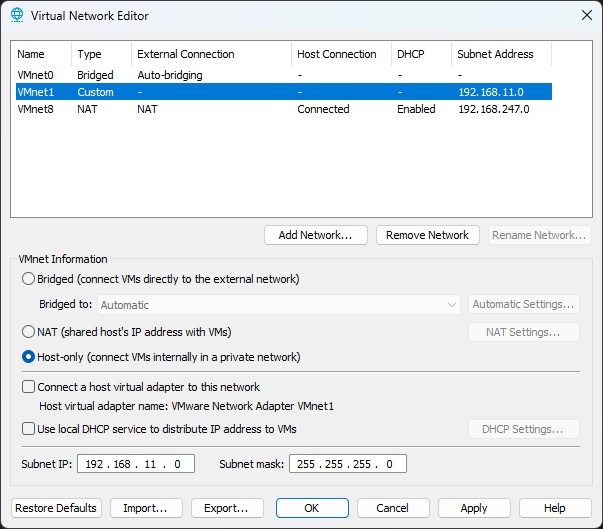

3. Állítsuk be a `vmnet8`-at az alábbiak alapján!

   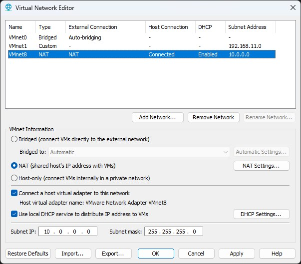

## 2. Ubuntu Server 24 LTS VMWare-be

1. Töltsük le a legfrissebb Ubuntu Server 24.04.2 LTS `.iso` fájlt az [Ubuntu weboldaláról](https://ubuntu.com/download/server)

   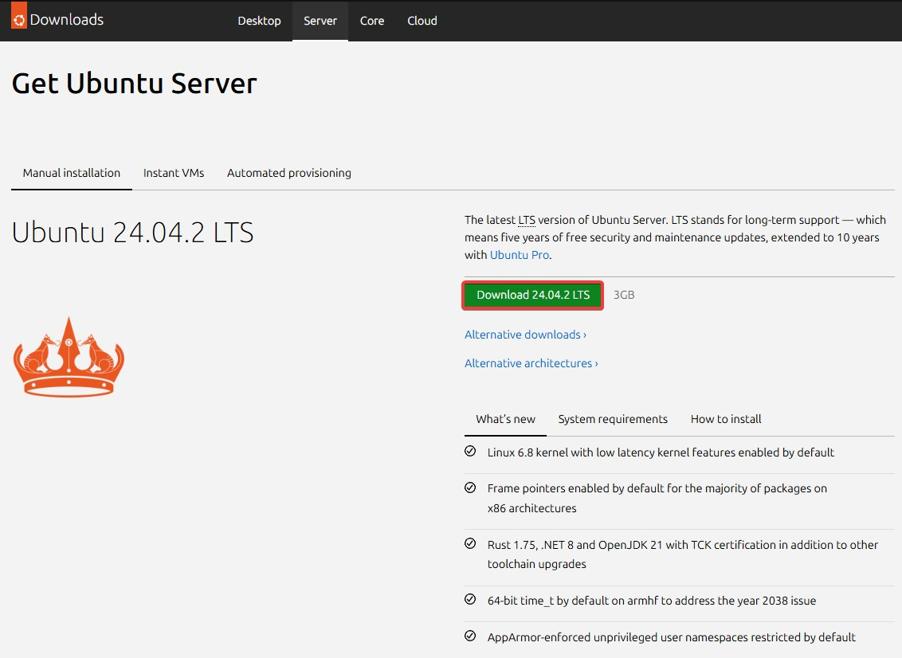

2. **Új Virtuális Gép Indítása**

   - Nyissuk meg a VMware Workstation Pro 17 alkalmazást, és válasszuk a `File > New Virtual Machine` menüpontot, vagy kattintsunk a **"Create a New Virtual Machine"** gombra. Ez elindítja a **"New Virtual Machine Wizard"** varázslót.

3. **Konfiguráció Típusának Kiválasztása**

   - A varázsló első lépésében válasszuk a **Typical (recommended)** opciót a gyorsabb beállítás érdekében. Ez a Boilerplate Kft. egyszerű infrastruktúrájához megfelelő választás.

     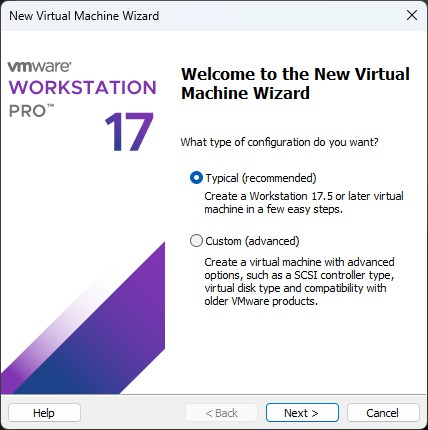

   - Kattintsunk a `Next` gombra.

4. **Virtuális Gép Elnevezése és Helye**

   - Adjuk meg az `.iso` fájl elérési útvonalát:

     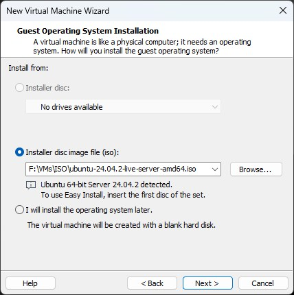

   - Kattintsunk a `Next` gombra.

   - **Virtual machine name**: `UbuntuServer`
   - **Location**: `C:\Users\<User>\Documents\Virtual Machines\UbuntuServer` (vagy más, általad választott hely).
   - A helyszín később módosítható az `Edit > Preferences` menüben, ha szükséges.

     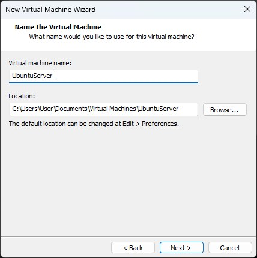

   - Kattintsunk a `Next` gombra.

5. **Lemezkapacitás Beállítása**

   Állítsuk be a virtuális gép merevlemezének kapacitását:

   - **Maximum disk size (GB)**: `50 GB` (a Boilerplate Kft. szerverének elegendő, figyelembe véve a GitLab és Docker konténerek tárhelyigényét).
   - **Disk allocation**: Válasszuk a **Split virtual disk into multiple files** opciót. Ez megkönnyíti a virtuális gép mozgatását, bár nagy lemezek esetén kissé csökkentheti a teljesítményt.

     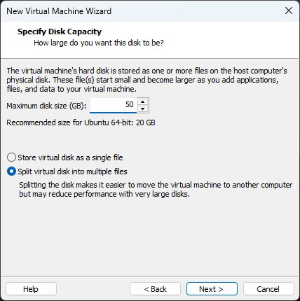

   - Kattintsunk a `Next` gombra.

6. **Összegzés és Testreszabás**

   A **"Ready to Create Virtual Machine"** képernyőn ellenőrizzük a beállításokat:

   - **Name**: `UbuntuServer`
   - **Location**: `C:\Users\<User>\Documents\Virtual Machines\UbuntuServer`
   - **Version**: `Workstation 17.5 or later`
   - **Operating System**: `Ubuntu 64-bit`
   - **Hard Disk**: `50 GB, Split`
   - **Memory**: `4096 MB`
   - **Network Adapter**: `Custom (VMnet8)`
   - **Other Devices**: 2 CPU cores, CD/DVD, USB Controller, Sound Card

     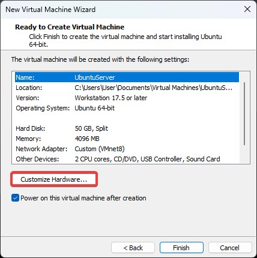

   Ha szükséges, kattintsunk a **Customize Hardware...** gombra a részletes konfigurációhoz, különben ugorjunk a **7. lépésre**.

7. **Virtuális Gép Létrehozása**

   Kattintsunk a `Finish` gombra a virtuális gép létrehozásához. A VMware automatikusan elindítja a gépet, és megkezdheti az Ubuntu Server telepítését az ISO fájlból.

## 3. Virtuális Gép Hardverkonfigurációja

A Boilerplate Kft. projektjének megfelelően a virtuális gép hardverét a következőképpen kell konfigurálni a **"Customize Hardware"** ablakban:

1. **Memória Beállítása**

   - **Memory for this virtual machine**: `4096 MB` (4 GB). Ez elegendő az Ubuntu Server 24 LTS, a Docker konténerek (GitLab, Nginx, webszolgáltatások) és a kis fejlesztőcsapat igényeinek kielégítésére.
   - A VMware ajánlása szerint a memória ne lépje túl a hoszt gép kapacitásának felét, hogy elkerüljük a teljesítményproblémákat.

     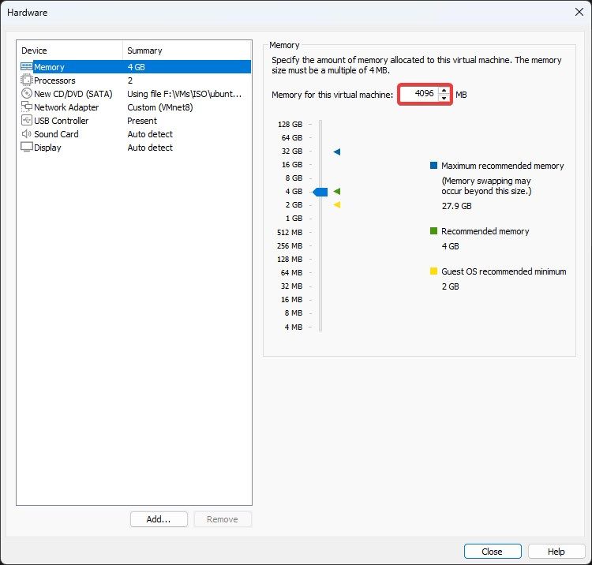

2. **Processzor Beállítása**

   - **Number of processors**: `4`
   - **Number of cores per processor**: `1`
   - **Total processor cores**: `4`
   - **Virtualization Engine**: Amennyiben szükséges jelöljük be a **"Virtualize Intel VT-x/EPT or AMD-V/RVI"** opciót a jobb teljesítmény érdekében. Ez lehetővé teszi a virtualizált környezetben futó Docker konténerek hatékonyabb kezelését.

     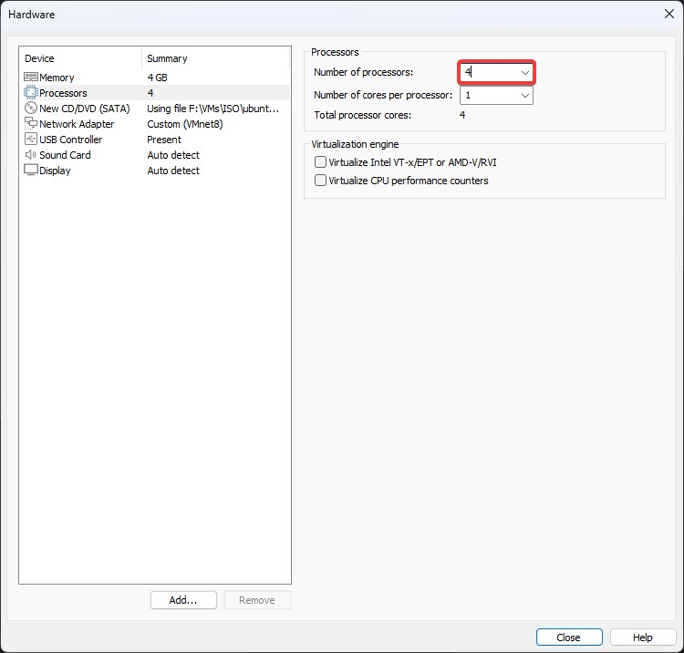

3. **Hálózati Adapter Beállítása**

   - **Network connection**: Válasszuk a **Custom: Specific virtual network** opciót.
   - **VMnet**: `VMnet8 (NAT)`
   - Ez biztosítja, hogy a virtuális gép a MikroTik router által forgalomirányított belső hálózaton keresztül kommunikáljon `(192.168.11.0/24)`, és `NAT`-on keresztül férjen hozzá az internethez.

     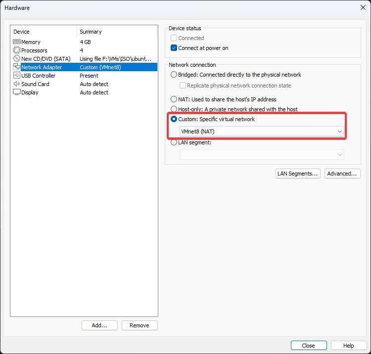

   - Kattintsunk a `Close` gombra.

4. **Beállítások Mentése**  
   A konfiguráció befejezése után kattintsunk a `Finish` gombra a **"Ready to Create Virtual Machine"** ablakban.

   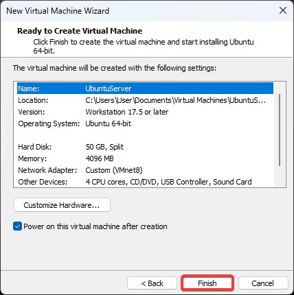

## 4. Ubuntu Server 24 LTS telepítési folyamata VMWare-be

1. **GRUB Indítás és Kiválasztás**

   Miután a virtuális gép elindul, a `GRUB` menü jelenik meg.

   - Válasszuk ki a **Try or Install Ubuntu Server** opciót az Ubuntu Server telepítéséhez.

   - Nyomjuk meg az **Enter** billentyűt a kiválasztott opció elindításához.

     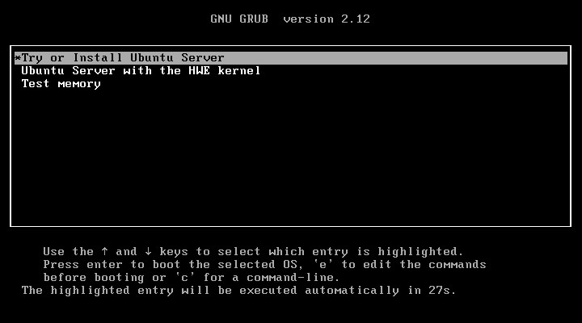

2. **Nyelv Beállítása**

   Válasszuk ki a telepítéshez használni kívánt nyelvet:

   - Használjuk a **fel** és **le** nyilakat a navigációhoz, és az **Enter** billentyűt a kiválasztáshoz.
   - Válasszuk az **English** (Angol) nyelvet.
   - Nyomjuk meg az **Enter** billentyűt.

     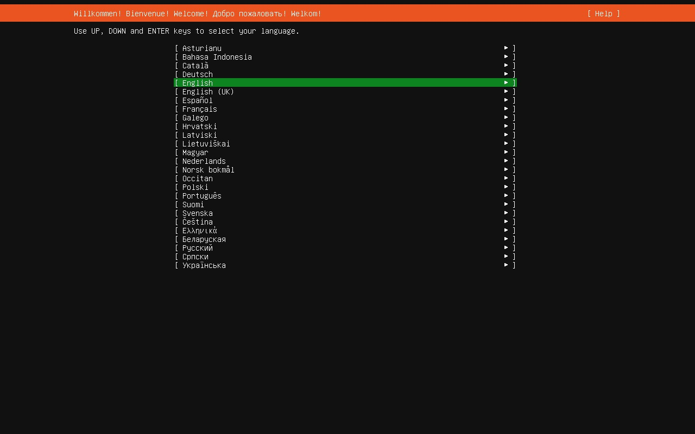

3. **Billentyűzetkiosztás Beállítása**

   Állítsuk be a billentyűzetkiosztást:

   - **Layout**: Válasszuk az **English (US)** opciót.
   - **Variant**: Válasszuk az **English (US)** opciót.
   - Kattintsunk a **Done** gombra.

     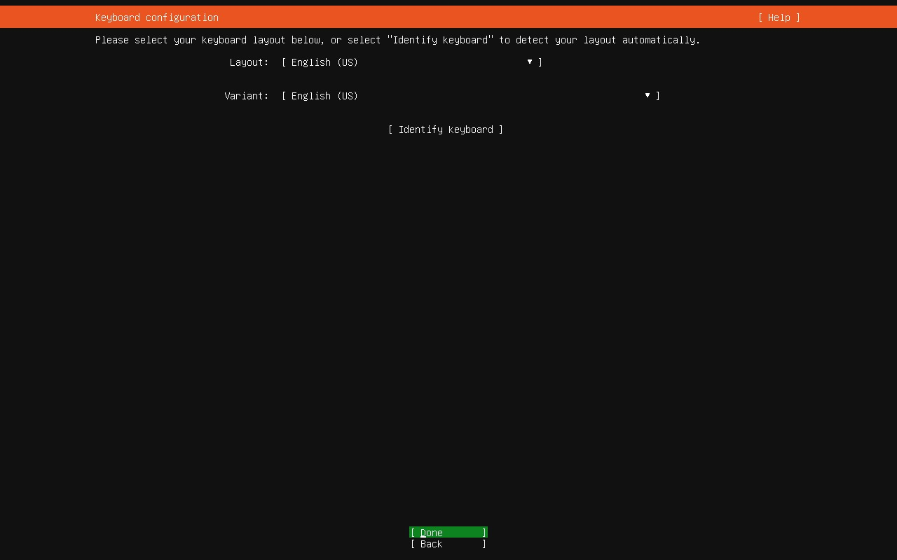

4. **Telepítési Típus Választása**

   Válasszuk ki a telepítési típust:

   - Jelöljük be az **Ubuntu Server** opciót a teljes szervertelepítéshez.
   - Hagyjuk ki az **Ubuntu Server (Minimized)** opciót, ha nem minimalizált rendszert szeretnénk.
   - Az **Additional options** alatt az **Search for third-party drivers** opció opcionális.
   - Kattintsunk a **Done** gombra.

     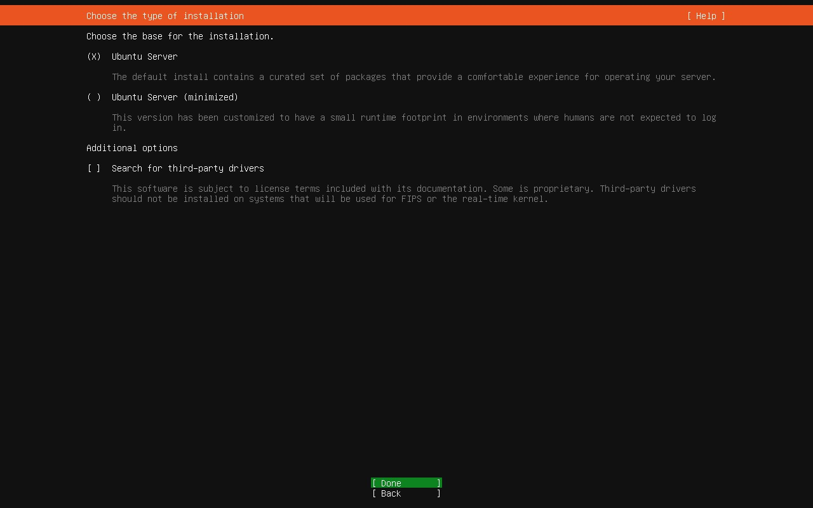

5. **Hálózati Konfiguráció - Interfész Kiválasztása**

   Konfiguráljuk a hálózati beállításokat:

   - Válasszuk ki az **ens33** interfészt a listából.
   - Kattintsunk a jobb oldali nyílra (**>**) az IPv4 konfiguráció szerkesztéséhez.

     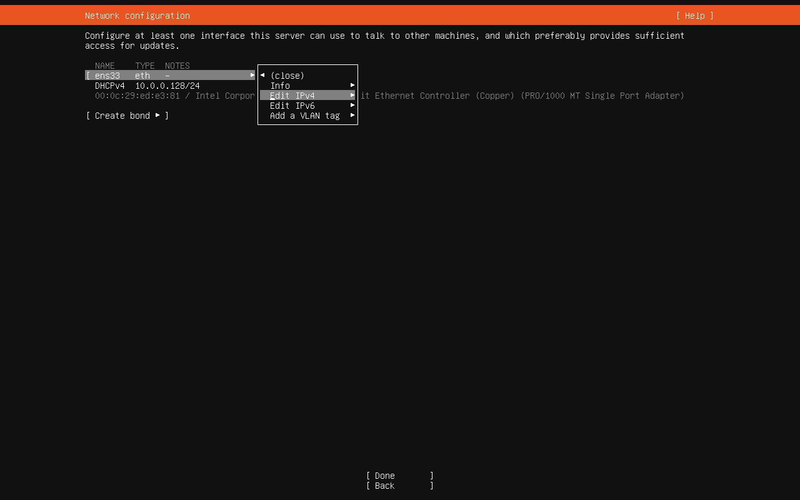

6. **IPv4 Konfiguráció - Statikus Beállítás**

   Állítsuk be a statikus IP-címet az **ens33** interfészhez:

   - **IPv4 Method**: Válasszuk a **Manual** opciót.

     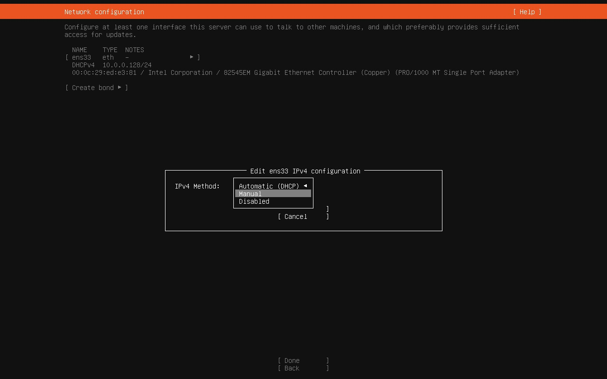

   - **Subnet**: `192.168.11.0/24`
   - **Address**: `192.168.11.11`
   - **Gateway**: `192.168.11.1`
   - **Name servers**: `192.168.11.1` (vesszővel elválasztva, ha több van)
   - Hagyjuk üresen a **Search domains** mezőt.
   - Kattintsunk a **Save** gombra.

     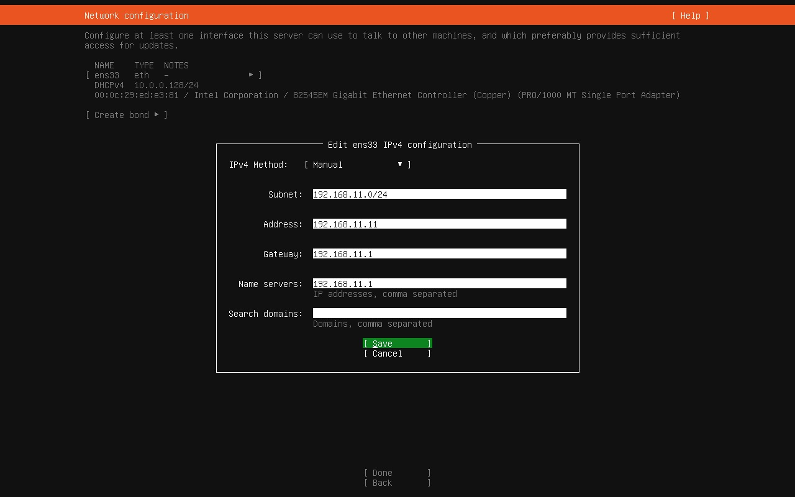

7. **Hálózati Konfiguráció - Visszaigazolás**

   Ellenőrizzük a hálózati beállításokat, majd kattintsunk a **Done** gombra a folytatáshoz.

   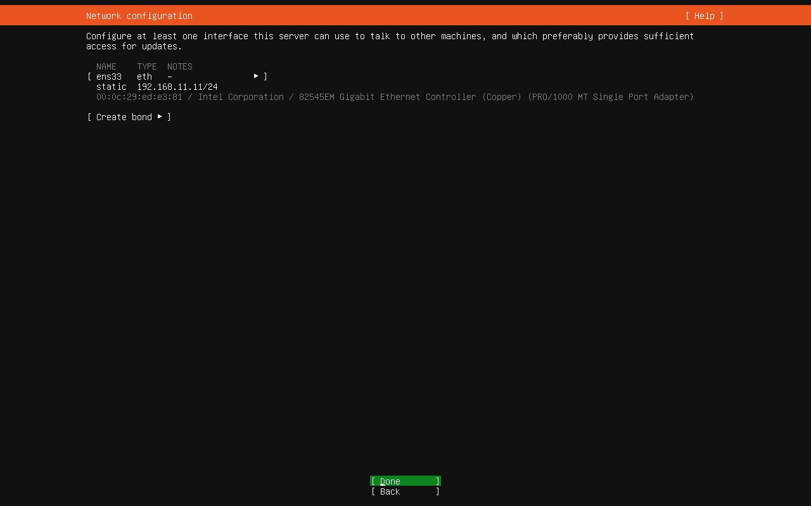

8. **Proxy Beállítása (Opcionális)**

   A telepítés során a rendszer kérheti a proxy konfigurációját:

   - Ha nincs proxy, hagyjuk üresen a **Proxy address** mezőt.
   - Kattintsunk a **Done** gombra a folytatáshoz.

     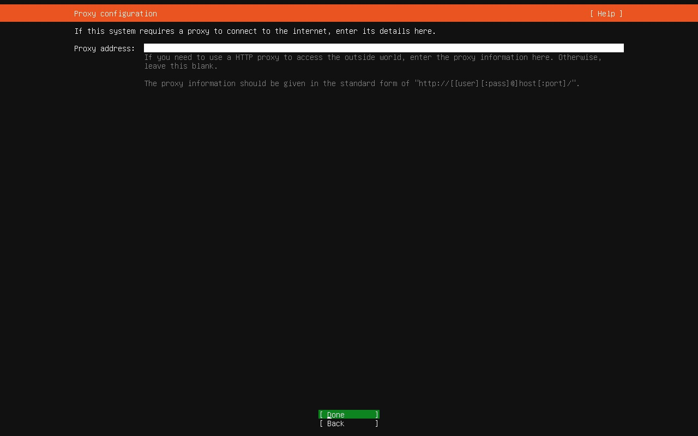

9. **Ubuntu Archívum Mirror Beállítása (Opcionális)**

   Állítsuk be az Ubuntu archívum mirrorját:

   - Ha alternatív tükrörre van szükségünk, akkor azt addjuk meg a **Mirror address** mezőben (pl. `http://archive.ubuntu.com/ubuntu/`).
   - A rendszer ellenőrzi a tükröt, ha sikeres, kattintsunk a **Done** gombra a folytatáshoz.

     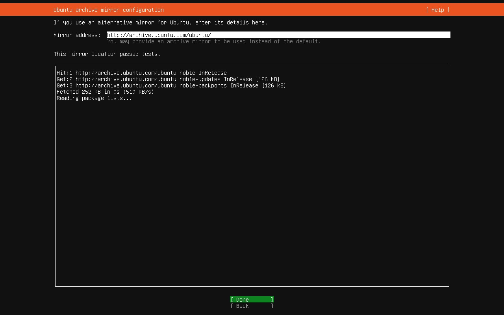

10. **Tároló Konfiguráció - Alapértelmezett Beállítások**

    A tároló konfigurációját az alapértelmezett beállításokkal végezzük el:

    - Jelöljük be a **Use an entire disk** opciót a teljes lemez használatához.
    - Jelöljük be a **Set up this disk as an LVM group** opciót az LVM (Logical Volume Manager) használatához.
    - Az **Encrypt the LVM group with LUKS** opciót hagyjuk kikapcsolva, mivel a projekt nem igényel titkosítást.
    - Kattintsunk a **Done** gombra a folytatáshoz.

      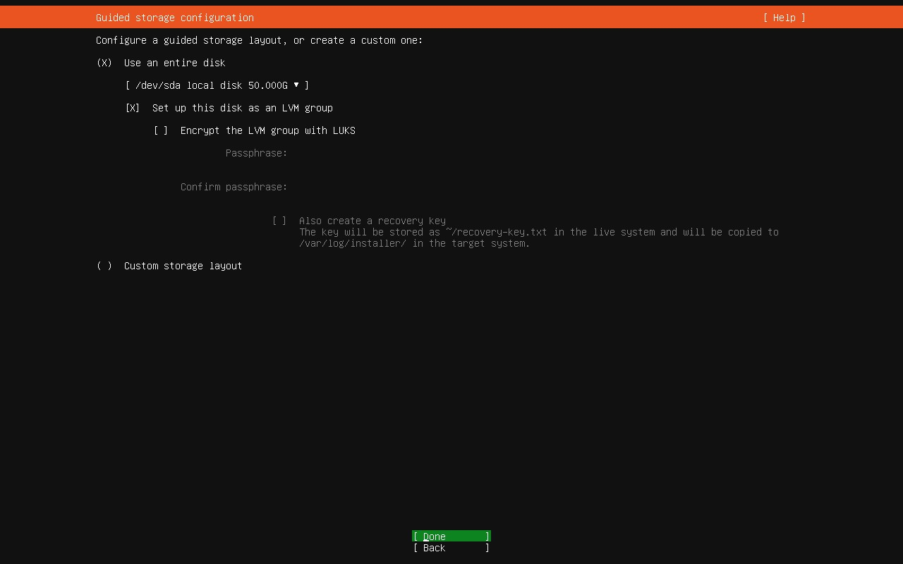

11. **Tároló Konfiguráció - Logikai Kötet Kiválasztása**

    Nyissuk meg szerkesztésre az `ubuntu-lv` kötetet:

    - Válasszuk ki az `ubuntu-lv` kötetet, majd nyomjuk meg az `Enter` gombot.
    - Válasszuk ki az `Edit` gombot, majd nyomjuk meg az `Enter` gombot.

      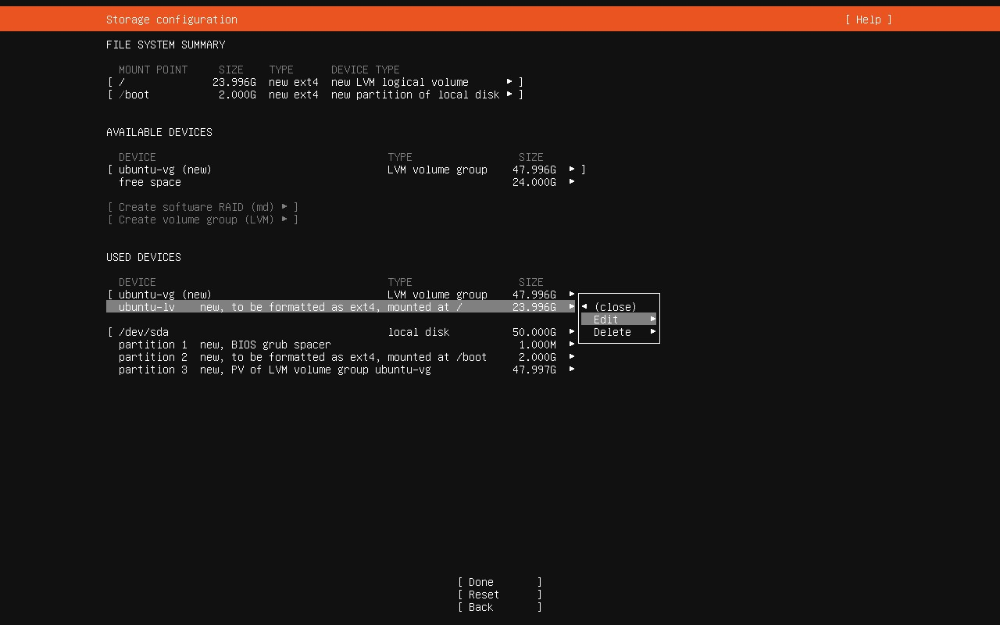

12. **Tároló Konfiguráció - Logikai Kötet Szerkesztése**

    Módosítsuk a logikai kötet beállításait:

    - **Name**: `ubuntu-lv`
    - **Size**: `47.996G` (maximális méret, mivel a teljes LVM kötetet használjuk).
    - **Format**: Válasszuk az **ext4** fájlrendszert.
    - **Mount**: `/` (gyökérkönyvtár).
    - Kattintsunk a **Save** gombra a mentéshez.

      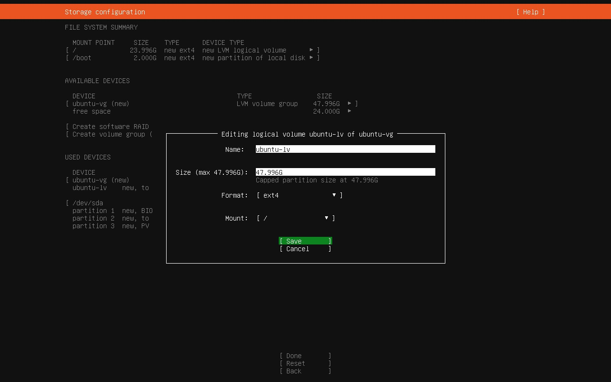

13. **Tároló Konfiguráció - Összegzés**

    Ellenőrizzük a tároló konfiguráció összefoglalóját:

    - **File System Summary**:
      - `/`: `47.996G`, új ext4 LVM logikai kötet.
      - `/boot`: `2.000G`, új ext4 partíció.
    - **Used Devices**:
      - `ubuntu-vg`: LVM kötetcsoport, `47.996G` méretű.
      - `/dev/sda`: Helyi lemez, `50.000G` méretű, felosztva a `/boot` és `LVM` partíciókra.
    - Kattintsunk a **Done** gombra a folytatáshoz.

      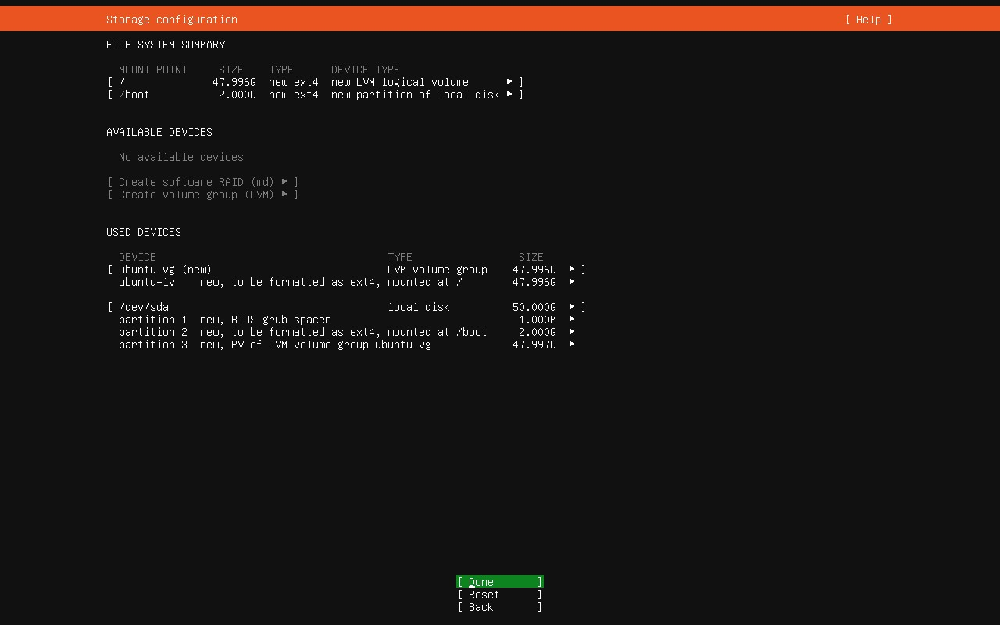

14. **Tároló Konfiguráció - Destruktív Művelet Megerősítése**

    A rendszer figyelmeztet a destruktív műveletre, amely adatvesztést okozhat:

    - Olvassuk el a figyelmeztetést: a folytatással a lemez formázása megkezdődik, és az adatok elvesznek.
    - Kattintsunk a **Continue** gombra a folytatáshoz.

      

15. **Felhasználói Profil Beállítása**

    Állítsuk be a felhasználói profilt a rendszerhez való bejelentkezéshez:

    - **Your name**: `UbuntuServer`
    - **Your server’s name**: `ubuntu-server`
    - **Pick a username**: `ubuntu`
    - **Choose a password**: Adjunk meg egy erős jelszót (pl. `Password1!`).
    - **Confirm your password**: Ismételjük meg a jelszót a megerősítéshez.
    - Kattintsunk a **Done** gombra a folytatáshoz.

    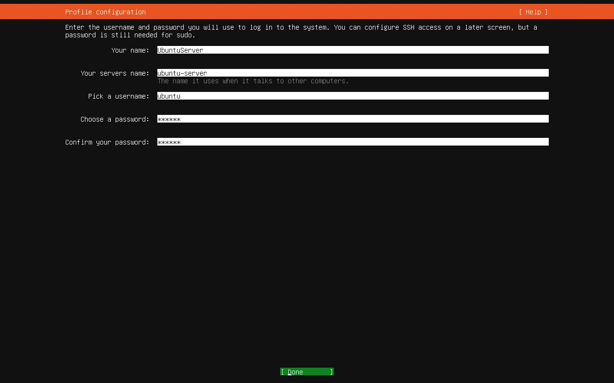

16. **Ubuntu Pro Frissítési Beállítások**

    A rendszer felkínálja az Ubuntu Pro előfizetés aktiválását a bővített frissítések érdekében:

    - Válasszuk a **Skip for now** opciót, mivel a Boilerplate Kft. projektjében nincs szükség Ubuntu Pro előfizetésre.
    - Kattintsunk a **Continue** gombra a folytatáshoz.

      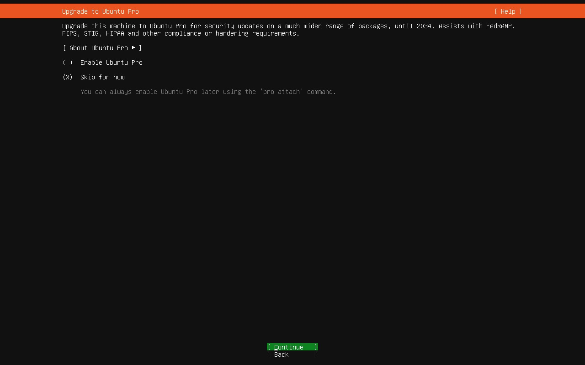

17. **SSH Beállítások Konfigurálása**

    A telepítés során lehetőség van az OpenSSH szerver telepítésére a távoli hozzáférés biztosítására:

    - Jelöljük be az **Install OpenSSH server** opciót a biztonságos távoli hozzáférés engedélyezéséhez.
    - Az **Import SSH key** lépést kihagyhatjuk, később egy szkript segítségével feltöltjük a kulcsunkat.
    - Kattintsunk a **Done** gombra a folytatáshoz.

      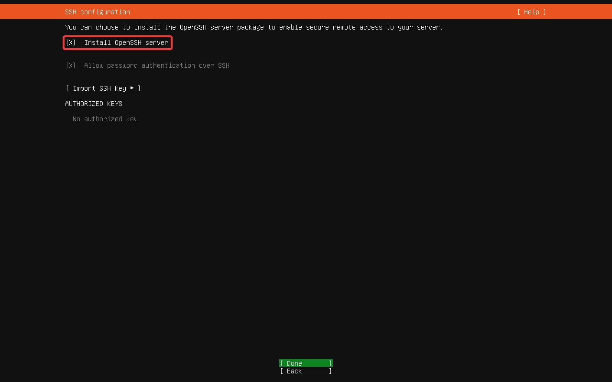

18. **Szerver Snap-ek Kiválasztása**

    Válasszuk ki a telepítendő szerver snap-eket:

    - Jelöljük be a **docker** snap-et, mivel a Boilerplate Kft. projektjei Docker-alapúak.
    - Jelöljük be a **powershell** snap-et az esetleges PowerShell szkriptek futtatásához.
    - A többi snap (pl. `microk8s`, `nextcloud`, `kata-containers`) nem szükséges, így ezeket hagyjuk ki.
    - Kattintsunk a **Done** gombra a folytatáshoz.

      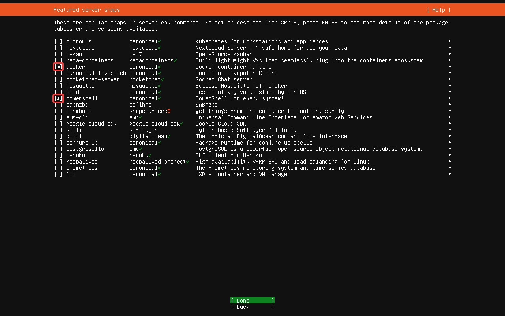

19. **Telepítés Befejezése és Újraindítás**

    A telepítés befejezése után a rendszer összefoglalja a folyamatot:

    - A telepítési napló látható, amely tartalmazza az összes lépést (pl. `curtin extract`, `install packages`, `configure grub`).
    - Várjuk meg, amíg a telepítés teljesen befejeződik.
    - Kattintsunk a **Reboot Now** gombra a rendszer újraindításához.

      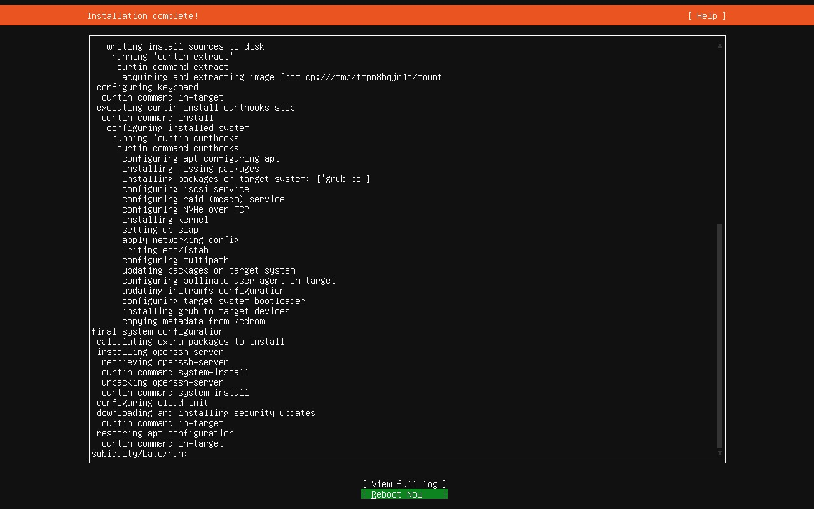

20. **ISO Lecsatlakoztatása**

    A telepítés befejezése után a rendszer megpróbálja lecsatlakoztatni az ISO-t, de hibaüzenet jelenhet meg:

    - A képernyőn a következő üzenet látható: **[FAILED] Failed unmounting cdrom.mount - /cdrom**.

      

    Távolítsuk el a virtuális gépen a telepítési ISO-t

    - VMware Workstation jobb alsó sarkában jobb klikk a `CD/DVD`-re, majd nyomjunk rá a `Disconnect` gombra.

      

    - Nyomjuk meg az **Enter** billentyűt a folytatáshoz.

21. **Rendszer Indítása és SSH Kulcsok Ellenőrzése**

    A rendszer újraindulása után a boot folyamat során a Cloud-Init inicializálja a környezetet:

    - Ellenőrizzük a naplóüzeneteket, amelyek a snap csomagok (pl. `docker`, `powershell`) telepítését és indítását jelzik.
    - A képernyőn megjelenik az SSH host fingerprint és kulcsok listája (pl. `ECDSA`, `ED25519`, `RSA`).
    - Várjuk meg, amíg a rendszer teljesen elindul.

      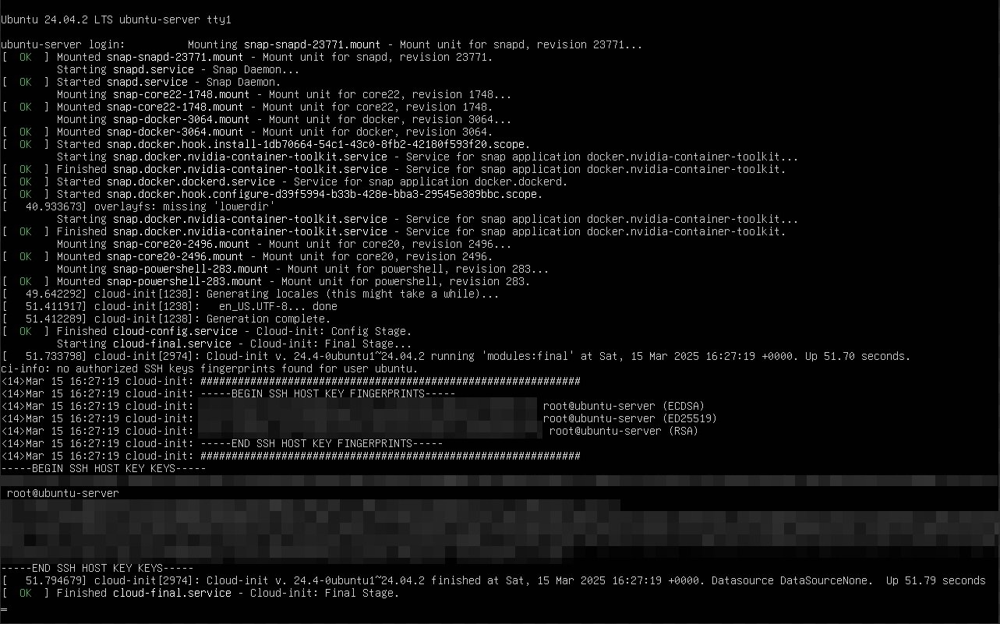

22. **Belépés a szerverre SSH segítségével**

**[↑ Lap teteje](#ubuntu-server-24-lts-telepítése)**

**[↩ Vissza](README.md)**
